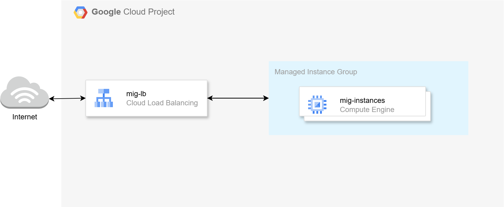
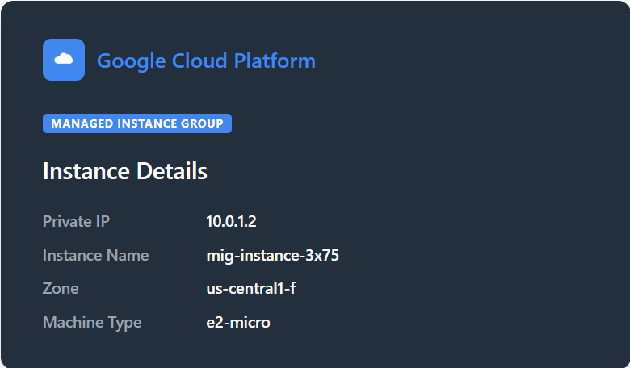

# GCP Managed Instance Group

This project demonstrates a minimal GCP Managed Instance Group (MIG) deployment using Terraform. It provisions a fleet of Apache web servers behind a GCP HTTP(S) Load Balancer, with each instance displaying its own metadata — private IP, instance name, zone, and machine type — on a styled page.



Instances run on e2-micro Ubuntu VMs and are never directly reachable from the internet. All inbound traffic flows through the global HTTP load balancer. Cloud NAT provides outbound internet access for package installation. A regional autoscaler drives automatic scale-out and scale-in between 1 and 6 instances based on CPU utilization.

This solution is ideal for understanding the fundamentals of GCP Managed Instance Groups without the complexity of application-specific configuration. It uses no Packer, no custom image, and deploys in a single Terraform phase.



## Prerequisites

* [A GCP Account](https://console.cloud.google.com/)
* [Install Google Cloud CLI](https://cloud.google.com/sdk/docs/install)
* [Install Latest Terraform](https://developer.hashicorp.com/terraform/install)
* A service account key file saved as `credentials.json` in the project root

If this is your first time watching our content, we recommend starting with this video: [GCP + Terraform: Easy Setup](https://youtu.be/BCMQo0CB9wk). It provides a step-by-step guide to properly configure Terraform and the Google Cloud CLI.

---

## Download this Repository

```bash
git clone https://github.com/mamonaco1973/gcp-mig.git
cd gcp-mig
```

---

## Authenticate to GCP

Place your service account key at the project root:

```bash
cp /path/to/your-key.json ./credentials.json
```

---

## Build the Code

Run [check_env](check_env.sh) to validate your environment, then run [apply](apply.sh) to provision the infrastructure.

```bash
./apply.sh
```

[apply.sh](apply.sh) runs `terraform init` and `terraform apply`, then automatically calls [validate.sh](validate.sh) to confirm the deployment is healthy. Note that the global HTTP load balancer takes 5-8 minutes to propagate after creation.

---

### Build Results

When the deployment completes, the following resources are created:

- **Networking:**
  - A custom VPC (`mig-vpc`) in us-central1 with one subnet:
    - `mig-subnet` (10.0.1.0/24) — MIG instances
  - Cloud Router and Cloud NAT for instance outbound access

- **Security:**
  - Firewall rule allowing GCP health check and LB proxy ranges (130.211.0.0/22, 35.191.0.0/16) to port 80 on tagged instances

- **HTTP Load Balancer:**
  - Global static IP address
  - HTTP health check on `/` with 10-second intervals
  - Layer 7 per-request load balancing — even distribution across instances

- **Managed Instance Group:**
  - Ubuntu 24.04 LTS, e2-micro, regional MIG spread across all us-central1 zones
  - min 1, desired 4, max 6 instances
  - Apache installed via startup script; displays GCP metadata page
  - Regional autoscaler driving scale-out and scale-in on CPU

---

### Scaling Policies

| Rule      | Condition  | Window  | Action      |
|-----------|------------|---------|-------------|
| scale-out | CPU > 60%  | 2 min   | +1 instance |
| scale-in  | CPU < 60%  | 1 hour  | -1 instance |

The long scale-in window (1 hour) prevents instances from being removed during demos or brief quiet periods.

---

### Validate the Deployment

[validate.sh](validate.sh) is called automatically by [apply.sh](apply.sh). It polls the load balancer until it responds, then samples 10 responses to confirm load balancing is working. Because the LB is Layer 7, each request is routed independently — different IP addresses across requests confirm even distribution.

```
NOTE: Load balancer endpoint: http://34.120.x.x
NOTE: Waiting for HTTP response from load balancer...
NOTE: Load balancer is responding.
NOTE: Sampling load balancer responses...

  [1] 10.0.1.3
  [2] 10.0.1.5
  [3] 10.0.1.4
  [4] 10.0.1.6
  [5] 10.0.1.3
  [6] 10.0.1.5
  [7] 10.0.1.4
  [8] 10.0.1.6
  [9] 10.0.1.3
  [10] 10.0.1.5

=================================================================================
  Managed Instance Group — Deployment validated!
=================================================================================
  LB : http://34.120.x.x
=================================================================================
```

---

### Clean Up Infrastructure

When you are finished testing, you can remove all provisioned resources with:

```bash
./destroy.sh
```

This will use Terraform to delete all provisioned resources — VPC, Cloud NAT, HTTP load balancer, Managed Instance Group, autoscaler, firewall rules, and the global static IP.
